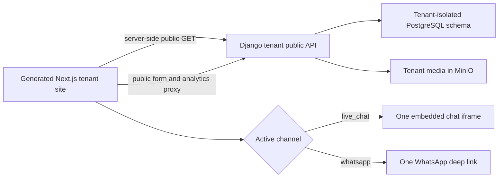

# Architecture and public API boundary

## Runtime rule

One generated repository serves one tenant hostname and reads one tenant public API base URL. The browser never receives Django admin credentials, platform endpoints, or a management token.

The frontend supports site bundle/config, navigation, footer, pages, all public collections and detail routes, galleries, media, locations, forms, search, sitemap, redirects, analytics, and active channel. It intentionally has no staff dashboard or authenticated management client.

## Presentation layers

1. Django API: facts, translated copy, assets, order, visibility, theme tokens.
2. Onboarding manifest: business intent, visual direction, structural experience, selected component catalogs, deployment and AI policy.
3. Generated profile: typed deterministic input to React composition.
4. AI refinement: bounded code changes under `TENANT_AGENT_BRIEF.md`.

Tailwind utilities are the styling source. CSS variables only transport dynamic branding values returned by the tenant API.

## Locale flow

`?locale=id|en` is persisted in a tenant-local cookie. Server components pass the same locale to site shell, CMS resources, collection routes, contact forms, newsletter, metadata, and the API. This prevents server/client translation mismatches.
